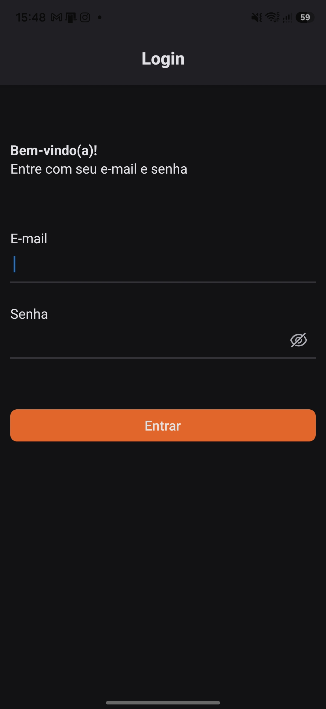
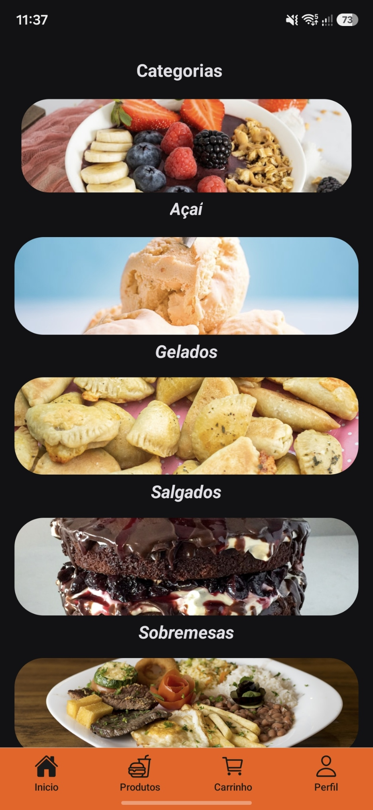
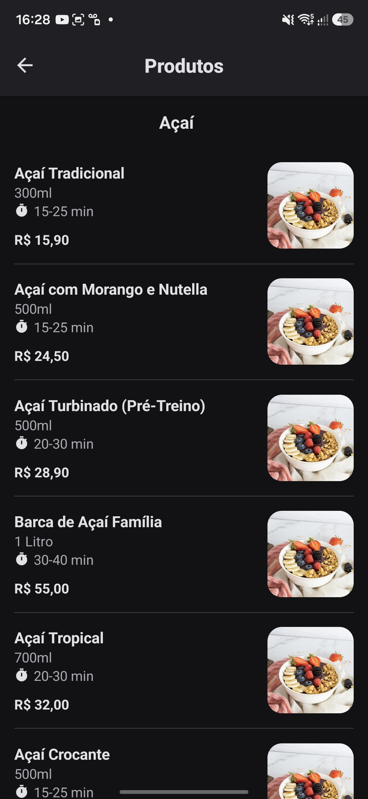
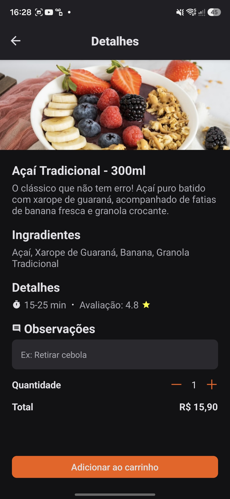
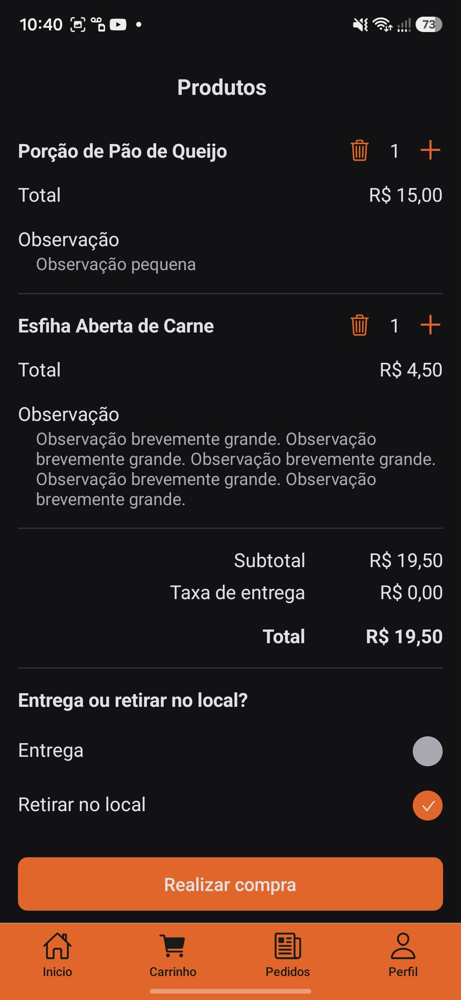
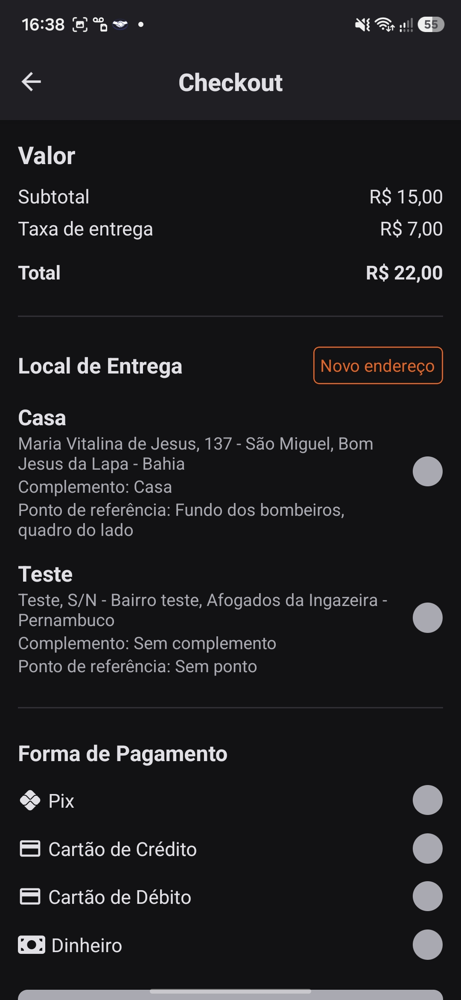
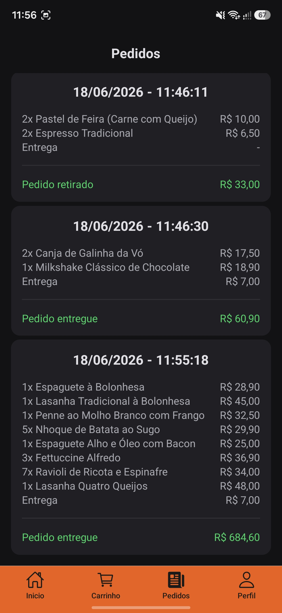

# InfnetFood

Aplicativo feito para o Assessment (trabalho final) da matéria de Desenvolvimento Mobile com React Native do Instituto Infnet. É um aplicativo móvel que simula um app de delivery, como o App "Pede Ai". Todas as telas adicionadas, o que deveriam conter e a forma como foram adicionadas, foi seguindo as instruções do Assessment.

# Demonstração

|                      Login                      |                      Categorias                      |                      Produtos                       |                  Detalhes do produto                  |                      Carrinho                      |                       Checkout                        |                  Histórico de pedidos                  |
| :---------------------------------------------: | :--------------------------------------------------: | :-------------------------------------------------: | :---------------------------------------------------: | :------------------------------------------------: | :---------------------------------------------------: | :----------------------------------------------------: |
|  |  |  |  |  |  |  |

# Principais tecnologias:

- [React Native](https://reactnative.dev/)
- [Expo](https://expo.dev/)
- [React Navigation](https://reactnavigation.org/) (Roteamento e navegação)
- [React Native Maps](https://github.com/react-native-maps/react-native-maps) (Geolocalização)
- Context API (Gerenciamento de estados globais)

# Como rodar o App:

- Você precisará ter uma conta no firebase com o "Authentication" ativado. O firebase vai te fornecer todas as configurações da sua conta. Você precisará delas para rodar o App.
- Depois clone o repositório e crie um arquivo chamado ".env" na raiz do projeto. Utilize como base o arquivo .env.exemple para saber como preencher o arquivo, depois pegue as configurações que o firebase te deu e coloque em cada variável do .env.
- Você também precisará ter o aplicativo "Expo Go" instalado no seu celular para abrir o app.
- Abra um terminal na pasta raiz do repositório que você clonou, instale as dependências (npx expo install) e depois execute o servidor (npx expo start). Um QR Code será gerado, leia-o com o app Expo Go e o aplicativo será aberto. Não há uma tela para se cadastrar, então você precisará criar um usuário manualmente dentro do firebase para fazer login no App. Uma vez feito o login, você verá todas as telas e funcionalidades do app. Todos os dados lá dentro (como categorias, produtos e dados de perfil) são simulados.

Autor: @damilhome
